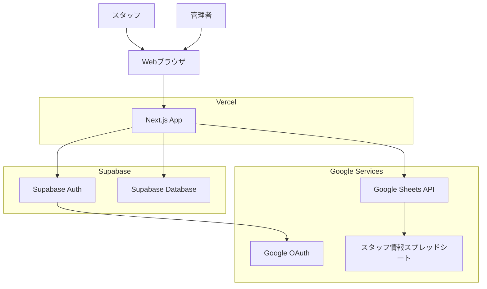

# 設計書

## 概要

勤怠管理アプリケーションは、Next.js、TypeScript、Supabase、Vercelを使用して構築されるフルスタックWebアプリケーションです。Google OAuth 2.0を使用してスタッフを認証し、出退勤時刻をワンクリックで記録します。システムは曜日に基づいて標準労働時間を自動判定し、休憩時間を控除した上で残業時間を計算します。

管理者は、Google Sheetsからスタッフ情報を同期できます。組織アカウント（@ifoo-oita.com）ではGoogle APIが利用できないため、システム管理者として指定された特定のスタッフの個人Gmailアカウントのトークンを使用してGoogle Sheets APIにアクセスします。

### 技術スタック

- **フロントエンド**: Next.js 14 (App Router), TypeScript, React
- **バックエンド**: Next.js API Routes, Supabase (PostgreSQL)
- **認証**: Supabase Auth with Google OAuth
- **デプロイ**: Vercel
- **バージョン管理**: GitHub

## アーキテクチャ

### システム構成



### レイヤー構造

1. **プレゼンテーション層** (Next.js Pages/Components)
   - ユーザーインターフェース
   - 出退勤ボタン、ステータス表示、履歴表示

2. **ビジネスロジック層** (Services/Utils)
   - 残業時間計算ロジック
   - 勤怠記録の検証ロジック
   - 日付・時刻処理

3. **データアクセス層** (Supabase Client)
   - データベースクエリ
   - トランザクション管理

4. **認証層** (Supabase Auth)
   - Google OAuth統合
   - セッション管理

## コンポーネントとインターフェース

### フロントエンドコンポーネント

#### 1. AuthProvider
- Google認証の状態管理
- セッション維持
- 未認証時のリダイレクト

#### 2. AttendanceButton
- 出勤/退勤ボタンのUI
- 現在の状態に応じたボタン表示切り替え
- クリックイベント処理

#### 3. StatusDisplay
- 現在の出退勤ステータス表示
- 当日の出勤時刻/退勤時刻表示
- リアルタイム更新

#### 4. AttendanceHistory
- 勤怠履歴の一覧表示
- 日付範囲フィルター
- ページネーション

### バックエンドAPI

#### 1. POST /api/attendance/clock-in
```typescript
interface ClockInRequest {
  // 認証情報はセッションから取得
}

interface ClockInResponse {
  success: boolean;
  data?: {
    id: string;
    staffId: string;
    date: string;
    clockIn: string;
  };
  error?: string;
}
```

#### 2. POST /api/attendance/clock-out
```typescript
interface ClockOutRequest {
  // 認証情報はセッションから取得
}

interface ClockOutResponse {
  success: boolean;
  data?: {
    id: string;
    staffId: string;
    date: string;
    clockIn: string;
    clockOut: string;
    workHours: number;
    overtime: number;
  };
  error?: string;
}
```

#### 3. GET /api/attendance/current
```typescript
interface CurrentStatusResponse {
  success: boolean;
  data?: {
    status: 'not_clocked_in' | 'clocked_in' | 'clocked_out';
    record?: {
      date: string;
      clockIn?: string;
      clockOut?: string;
    };
  };
  error?: string;
}
```

#### 4. GET /api/attendance/history
```typescript
interface HistoryRequest {
  startDate?: string;
  endDate?: string;
  page?: number;
  limit?: number;
}

interface HistoryResponse {
  success: boolean;
  data?: {
    records: AttendanceRecord[];
    total: number;
    page: number;
  };
  error?: string;
}
```

#### 5. POST /api/staff/sync
```typescript
interface StaffSyncRequest {
  // 認証情報はセッションから取得
  // システム管理者のトークンを使用
}

interface StaffSyncResponse {
  success: boolean;
  data?: {
    synced: number;
    added: number;
    updated: number;
  };
  error?: string;
}
```

#### 6. GET /api/staff/system-admin-status
```typescript
interface SystemAdminStatusResponse {
  success: boolean;
  data?: {
    hasSystemAdmin: boolean;
    systemAdminEmail?: string;
    isGoogleConnected: boolean;
  };
  error?: string;
}
```
    page: number;
  };
  error?: string;
}
```

### サービス層

#### AttendanceService
```typescript
class AttendanceService {
  // 出勤記録作成
  async createClockIn(staffId: string): Promise<AttendanceRecord>
  
  // 退勤記録更新
  async updateClockOut(staffId: string): Promise<AttendanceRecord>
  
  // 当日の記録取得
  async getTodayRecord(staffId: string): Promise<AttendanceRecord | null>
  
  // 履歴取得
  async getHistory(staffId: string, filters: HistoryFilters): Promise<AttendanceRecord[]>
  
  // 重複チェック
  async checkDuplicateClockIn(staffId: string, date: string): Promise<boolean>
}
```

#### OvertimeCalculator
```typescript
class OvertimeCalculator {
  // 残業時間計算
  calculateOvertime(clockIn: Date, clockOut: Date): number
  
  // 標準労働時間取得
  getStandardHours(date: Date): { start: string; end: string }
  
  // 実労働時間計算（休憩控除）
  calculateWorkHours(clockIn: Date, clockOut: Date): number
}
```

#### GoogleSheetsService
```typescript
class GoogleSheetsService {
  // システム管理者のトークンを使用してスプレッドシートからスタッフ情報を取得
  async fetchStaffFromSheet(): Promise<StaffData[]>
  
  // システム管理者のトークンを取得
  async getSystemAdminToken(): Promise<string | null>
  
  // トークンの有効性を確認
  async validateToken(token: string): Promise<boolean>
}
```

#### StaffService
```typescript
class StaffService {
  // スタッフ情報の同期（Google Sheetsから）
  async syncStaffFromSheet(): Promise<SyncResult>
  
  // システム管理者の設定
  async setSystemAdmin(staffId: string): Promise<void>
  
  // システム管理者の取得
  async getSystemAdmin(): Promise<Staff | null>
  
  // システム管理者のステータス確認
  async getSystemAdminStatus(): Promise<SystemAdminStatus>
}
```

## データモデル

### Supabaseテーブル設計

#### staffs テーブル
```sql
CREATE TABLE staffs (
  id UUID PRIMARY KEY DEFAULT uuid_generate_v4(),
  email TEXT UNIQUE NOT NULL,
  name TEXT NOT NULL,
  is_system_admin BOOLEAN DEFAULT FALSE,
  created_at TIMESTAMP WITH TIME ZONE DEFAULT NOW(),
  updated_at TIMESTAMP WITH TIME ZONE DEFAULT NOW()
);

CREATE INDEX idx_staffs_email ON staffs(email);
CREATE UNIQUE INDEX idx_staffs_system_admin ON staffs(is_system_admin) WHERE is_system_admin = TRUE;
```

#### attendance_records テーブル
```sql
CREATE TABLE attendance_records (
  id UUID PRIMARY KEY DEFAULT uuid_generate_v4(),
  staff_id UUID NOT NULL REFERENCES staffs(id) ON DELETE CASCADE,
  date DATE NOT NULL,
  clock_in TIMESTAMP WITH TIME ZONE NOT NULL,
  clock_out TIMESTAMP WITH TIME ZONE,
  work_hours DECIMAL(4,2),
  overtime DECIMAL(4,2),
  created_at TIMESTAMP WITH TIME ZONE DEFAULT NOW(),
  updated_at TIMESTAMP WITH TIME ZONE DEFAULT NOW(),
  
  CONSTRAINT unique_staff_date UNIQUE(staff_id, date)
);

CREATE INDEX idx_attendance_staff_date ON attendance_records(staff_id, date DESC);
CREATE INDEX idx_attendance_date ON attendance_records(date DESC);
```

### TypeScript型定義

```typescript
interface Staff {
  id: string;
  email: string;
  name: string;
  isSystemAdmin: boolean;
  createdAt: Date;
  updatedAt: Date;
}

interface AttendanceRecord {
  id: string;
  staffId: string;
  date: string; // YYYY-MM-DD
  clockIn: string; // ISO 8601
  clockOut?: string; // ISO 8601
  workHours?: number;
  overtime?: number;
  leaveType: 'normal' | 'paid_leave' | 'special_leave' | 'half_leave' | 'compensatory_leave' | 'holiday_work' | 'new_employee_leave';
  halfLeavePeriod?: 'morning' | 'afternoon';
  createdAt: Date;
  updatedAt: Date;
}

interface AttendanceStatus {
  status: 'not_clocked_in' | 'clocked_in' | 'clocked_out';
  record?: AttendanceRecord;
}

interface LeaveSummary {
  paidLeaveCount: number;
  compensatoryLeaveCount: number;
  holidayWorkCount: number;
  newEmployeeLeaveCount: number; // 6ヶ月以内社員休暇
}
```


## 正確性プロパティ

*プロパティとは、システムのすべての有効な実行において真であるべき特性や振る舞いのことです。本質的には、システムが何をすべきかについての形式的な記述です。プロパティは、人間が読める仕様と機械で検証可能な正確性保証との橋渡しとなります。*

### プロパティ 1: 出勤記録の永続化ラウンドトリップ
*任意の*スタッフが出勤を記録した場合、データベースから取得した記録は記録時のタイムスタンプとスタッフIDを含んでいる必要があります
**検証対象: 要件 1.3**

### プロパティ 2: 出勤の重複防止
*任意の*スタッフが同じ日に2回出勤を試みた場合、2回目の試行はエラーを返し、データベースには1つの記録のみが存在する必要があります
**検証対象: 要件 1.4**

### プロパティ 3: 退勤は既存レコードを更新
*任意の*スタッフが出勤後に退勤した場合、勤怠記録の総数は増加せず、既存の記録に退勤時刻が追加される必要があります
**検証対象: 要件 2.2**

### プロパティ 4: 出勤なしの退勤はエラー
*任意の*スタッフが出勤せずに退勤を試みた場合、システムはエラーを返し、不完全な記録を作成しない必要があります
**検証対象: 要件 2.3**

### プロパティ 5: 退勤の重複防止
*任意の*スタッフが同じ日に2回退勤を試みた場合、2回目の試行はエラーを返し、退勤時刻は変更されない必要があります
**検証対象: 要件 2.4**

### プロパティ 6: 認証されたメールアドレスとスタッフの照合
*任意の*登録済みメールアドレスで認証した場合、システムは正しいスタッフ情報を取得し、セッションに紐付ける必要があります
**検証対象: 要件 3.3**

### プロパティ 7: 未登録メールアドレスの拒否
*任意の*未登録メールアドレスで認証を試みた場合、システムはアクセスを拒否しエラーメッセージを返す必要があります
**検証対象: 要件 3.4**

### プロパティ 8: スタッフメールアドレスの一意性
*任意の*メールアドレスで2回スタッフを作成しようとした場合、2回目の試行はエラーを返し、重複レコードは作成されない必要があります
**検証対象: 要件 4.2**

### プロパティ 9: スタッフ情報更新のラウンドトリップ
*任意の*スタッフ情報を更新した場合、データベースから再取得した情報は更新後の値を含んでいる必要があります
**検証対象: 要件 4.3**

### プロパティ 10: メールアドレスによるスタッフ検索
*任意の*登録済みスタッフのメールアドレスで検索した場合、システムは正しいスタッフ情報を返す必要があります
**検証対象: 要件 4.4**

### プロパティ 11: 月曜日の標準労働時間
*任意の*月曜日の日付で残業計算を実行した場合、標準開始時刻は9:00、標準終了時刻は18:00として計算される必要があります
**検証対象: 要件 5.1**

### プロパティ 12: 月曜以外の標準労働時間
*任意の*火曜日から日曜日の日付で残業計算を実行した場合、標準開始時刻は9:30、標準終了時刻は18:00として計算される必要があります
**検証対象: 要件 5.2**

### プロパティ 13: 休憩時間の自動控除
*任意の*出勤時刻と退勤時刻で労働時間を計算した場合、計算結果は実際の経過時間から1時間を引いた値である必要があります
**検証対象: 要件 5.3**

### プロパティ 14: 残業時間の正確な計算
*任意の*標準労働時間を超える勤務時間で計算した場合、残業時間は（実労働時間 - 休憩1時間 - 標準労働時間）と等しい必要があります
**検証対象: 要件 5.4**

### プロパティ 15: 残業なしの場合はゼロ
*任意の*標準労働時間以下の勤務時間で計算した場合、残業時間は0である必要があります
**検証対象: 要件 5.5**

### プロパティ 16: 勤怠履歴の完全性
*任意の*スタッフに対して複数の勤怠記録を作成した場合、履歴取得時にすべての記録が返される必要があります
**検証対象: 要件 6.1**

### プロパティ 17: 勤怠記録の降順ソート
*任意の*複数の日付の勤怠記録を作成した場合、履歴取得時に日付の降順（新しい順）でソートされている必要があります
**検証対象: 要件 6.3**

### プロパティ 18: 日付範囲フィルタリング
*任意の*日付範囲で勤怠履歴をフィルタリングした場合、返される記録はすべて指定範囲内の日付である必要があります
**検証対象: 要件 6.5**

### プロパティ 19: ステータス表示の正確性
*任意の*スタッフの状態（未出勤、出勤中、退勤済み）において、ステータス取得時に正しい状態が返される必要があります
**検証対象: 要件 7.1**

### プロパティ 20: 出勤後のステータス更新
*任意の*スタッフが出勤した直後にステータスを取得した場合、ステータスは「出勤中」であり、出勤時刻が含まれている必要があります
**検証対象: 要件 7.2, 7.5**

### プロパティ 21: 退勤後のステータス更新
*任意の*スタッフが退勤した直後にステータスを取得した場合、ステータスは「退勤済み」であり、出勤時刻と退勤時刻の両方が含まれている必要があります
**検証対象: 要件 7.3, 7.5**

### プロパティ 22: 並行アクセスの独立性
*任意の*複数のスタッフが同時に出勤/退勤操作を実行した場合、各スタッフの記録は正しく独立して作成される必要があります
**検証対象: 要件 8.1**

### プロパティ 23: 競合更新の防止
*任意の*スタッフの同じ記録に対して同時に更新を試みた場合、最終的なデータは一貫性を保ち、データ損失が発生しない必要があります
**検証対象: 要件 8.3**

### プロパティ 24: システム管理者の一意性
*任意の*2人のスタッフをシステム管理者として設定しようとした場合、2人目の設定はエラーを返し、システム管理者は1人のみである必要があります
**検証対象: 要件 10.6**

### プロパティ 25: システム管理者トークンの使用
*任意の*スタッフ同期操作において、ログインユーザーのトークンではなく、システム管理者のトークンが使用される必要があります
**検証対象: 要件 10.2**

### プロパティ 26: システム管理者トークン不在時のエラー
*任意の*スタッフ同期操作において、システム管理者のトークンが存在しない場合、操作はエラーを返し実行されない必要があります
**検証対象: 要件 10.4**

### プロパティ 27: システム管理者ステータスの正確性
*任意の*時点でシステム管理者ステータスを取得した場合、現在のシステム管理者の情報とGoogle連携状態が正確に返される必要があります
**検証対象: 要件 10.7**

### プロパティ 28: 6ヶ月以内社員休暇の記録
*任意の*スタッフが6ヶ月以内社員休暇を記録した場合、データベースに正しく保存され、カウントが1増加する必要があります
**検証対象: 要件 11.1**

### プロパティ 29: 6ヶ月以内社員休暇は出退勤記録を作成しない
*任意の*スタッフが6ヶ月以内社員休暇を記録した場合、clock_inとclock_outはnullであり、leave_typeのみが設定される必要があります
**検証対象: 要件 11.2**

### プロパティ 30: 6ヶ月以内社員休暇の履歴表示
*任意の*スタッフが6ヶ月以内社員休暇を記録した場合、履歴取得時に他の休暇記録と共に表示される必要があります
**検証対象: 要件 11.3**

### プロパティ 31: 6ヶ月以内社員休暇のカウント表示
*任意の*スタッフが複数の6ヶ月以内社員休暇を記録した場合、メイン画面で正しい累計カウントが表示される必要があります
**検証対象: 要件 11.4**

### プロパティ 32: 管理画面での6ヶ月以内社員休暇表示
*任意の*スタッフが6ヶ月以内社員休暇を記録した場合、管理者の全社員サマリーで正しいカウントが表示される必要があります
**検証対象: 要件 11.5**

## エラーハンドリング

### エラーの種類

1. **認証エラー**
   - 未認証アクセス → 401 Unauthorized
   - 未登録メールアドレス → 403 Forbidden
   - セッション期限切れ → 401 Unauthorized

2. **バリデーションエラー**
   - 重複出勤 → 400 Bad Request
   - 出勤なしの退勤 → 400 Bad Request
   - 重複退勤 → 400 Bad Request
   - 重複メールアドレス → 409 Conflict
   - 複数のシステム管理者 → 409 Conflict

3. **Google API エラー**
   - トークン不在 → 400 Bad Request
   - トークン期限切れ → 401 Unauthorized
   - API呼び出し失敗 → 502 Bad Gateway
   - スプレッドシートアクセス権限なし → 403 Forbidden

3. **データベースエラー**
   - 接続エラー → 503 Service Unavailable
   - トランザクションエラー → 500 Internal Server Error
   - 制約違反 → 409 Conflict

4. **システムエラー**
   - 予期しないエラー → 500 Internal Server Error

### エラーレスポンス形式

```typescript
interface ErrorResponse {
  success: false;
  error: {
    code: string;
    message: string;
    details?: any;
  };
}
```

### エラーハンドリング戦略

1. **フロントエンド**
   - エラーメッセージをユーザーフレンドリーな日本語で表示
   - トーストまたはアラートでエラー通知
   - 認証エラー時は自動的にログイン画面へリダイレクト

2. **バックエンド**
   - すべてのAPIエンドポイントでtry-catchによるエラーキャッチ
   - データベーストランザクションのロールバック
   - エラーログの記録（本番環境）
   - スタックトレースは開発環境のみ

3. **データベース**
   - 制約違反の適切な処理
   - デッドロック時の自動リトライ（最大3回）
   - 接続プールの管理

## テスト戦略

### 1. ユニットテスト

**対象:**
- OvertimeCalculator（残業計算ロジック）
- 日付・時刻ユーティリティ関数
- バリデーション関数

**ツール:** Jest, React Testing Library

**重要なテストケース:**
- 月曜日の標準時間計算
- 月曜以外の標準時間計算
- 休憩時間控除の計算
- 残業時間の計算（残業あり/なし）
- 日付フォーマット変換

### 2. プロパティベーステスト

**ツール:** fast-check (TypeScript用プロパティベーステストライブラリ)

**設定:**
- 各プロパティテストは最低100回の反復実行
- ランダムなテストデータ生成
- 失敗時の反例を自動的に縮小

**テスト対象:**
- 上記で定義したすべての正確性プロパティ（プロパティ1〜23）
- 各プロパティテストには設計書のプロパティ番号を明記

**ジェネレータ:**
```typescript
// スタッフデータのジェネレータ
const staffGenerator = fc.record({
  email: fc.emailAddress(),
  name: fc.string({ minLength: 1, maxLength: 50 })
});

// 日時のジェネレータ
const dateTimeGenerator = fc.date({
  min: new Date('2024-01-01'),
  max: new Date('2025-12-31')
});

// 勤務時間のジェネレータ
const workHoursGenerator = fc.record({
  clockIn: dateTimeGenerator,
  clockOut: dateTimeGenerator
}).filter(({ clockIn, clockOut }) => clockOut > clockIn);
```

### 3. 統合テスト

**対象:**
- API エンドポイント
- データベース操作
- 認証フロー

**ツール:** Jest, Supertest, Supabase Test Client

**重要なシナリオ:**
- 出勤→退勤の完全なフロー
- 認証→出勤→履歴取得のフロー
- エラーケース（重複、未認証など）

### 4. E2Eテスト

**対象:**
- ユーザーの主要なフロー

**ツール:** Playwright

**シナリオ:**
- ログイン→出勤→ステータス確認
- ログイン→退勤→履歴確認
- エラーメッセージの表示確認

### テスト実行環境

- **ローカル開発:** Jest + fast-check
- **CI/CD:** GitHub Actions
  - プルリクエスト時: ユニットテスト + プロパティベーステスト
  - マージ前: 統合テスト + E2Eテスト
- **テストデータベース:** Supabase Local Development

## セキュリティ考慮事項

1. **認証・認可**
   - Google OAuth 2.0による安全な認証
   - Supabase Row Level Security (RLS)の有効化
   - スタッフは自分の記録のみアクセス可能

2. **データ保護**
   - HTTPS通信の強制
   - 環境変数による機密情報の管理
   - SQLインジェクション対策（Supabaseクライアント使用）

3. **セッション管理**
   - セッションタイムアウトの設定
   - CSRF対策（Next.jsのデフォルト保護）

## パフォーマンス考慮事項

1. **データベース最適化**
   - インデックスの適切な設定
   - クエリの最適化
   - 接続プールの活用

2. **フロントエンド最適化**
   - Next.js App Routerのキャッシング活用
   - Server Componentsの活用
   - 画像・アセットの最適化

3. **スケーラビリティ**
   - Vercelの自動スケーリング
   - Supabaseの接続プール管理
   - 数十人規模に最適化された設計

## デプロイメント

### 環境

1. **開発環境**
   - ローカル開発サーバー
   - Supabase Local Development

2. **本番環境**
   - Vercel (Next.js)
   - Supabase (Production)

### 環境変数

```
NEXT_PUBLIC_SUPABASE_URL=<Supabase URL>
NEXT_PUBLIC_SUPABASE_ANON_KEY=<Supabase Anon Key>
SUPABASE_SERVICE_ROLE_KEY=<Service Role Key>
```

### デプロイフロー

1. GitHubにプッシュ
2. Vercelが自動的にビルド・デプロイ
3. プレビュー環境で確認
4. mainブランチへのマージで本番デプロイ

## 今後の拡張可能性

1. **管理者機能**
   - スタッフ管理画面
   - 勤怠データのエクスポート
   - レポート機能

2. **通知機能**
   - 出勤忘れのリマインダー
   - 退勤忘れの通知

3. **モバイルアプリ**
   - React Nativeでのネイティブアプリ化
   - プッシュ通知

4. **高度な分析**
   - 月次レポート
   - 残業傾向の分析
   - ダッシュボード
